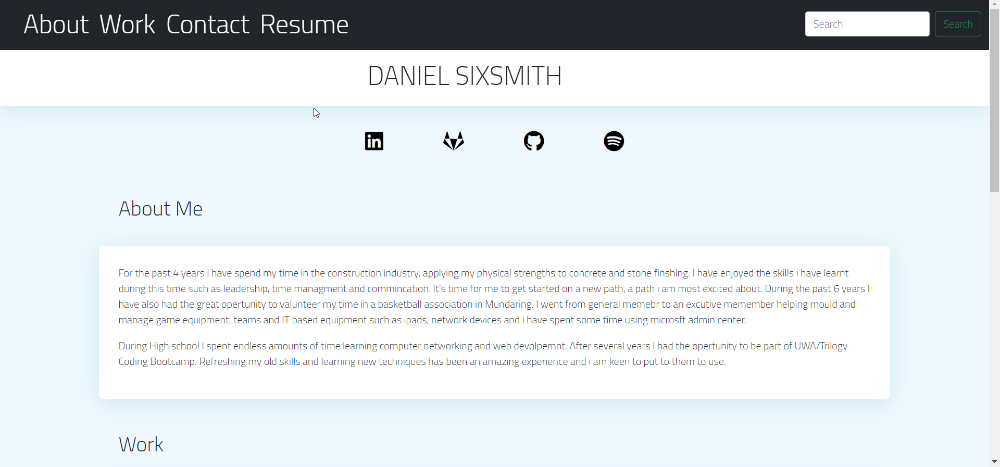

[![Forks][forks-shield]][https://github.com/SiddySixsmith/Portfolio/network/members]
[![Stargazers][stars-shield]][https://github.com/SiddySixsmith/Portfolio/stargazers]
[![Issues][issues-shield]][https://github.com/SiddySixsmith/Portfolio/issues]
[![LinkedIn][linkedin-shield]][www.linkedin.com/in/Daniel-Sixsmith]

<!-- PROJECT LOGO -->
 

  

<h3 align="center">Portfolio</h3>

  

    Project Portfolio is me. This webpage is a small piece of who i am and what i am able to do. It is simple but eligant.
     
    <a href="https://github.com/SiddySixsmith/Portfolio"><strong>Explore the docs »</strong></a>
     
     
    <a href="https://github.com/SiddySixsmith/Portfolio">View Demo</a>
    ·
    <a href="https://github.com/SiddySixsmith/Portfolio/issues">Report Bug</a>
    ·
    <a href="https://github.com/SiddySixsmith/Portfolio/issues">Request Feature</a>
  

<!-- TABLE OF CONTENTS -->

  
Table of Contents

  <ol>
    <li>
      <a href="#about-the-project">About The Project</a>
      <ul>
        <li><a href="#built-with">Built With</a></li>
      </ul>
    </li>
    <li><a href="#contact">Contact</a></li>
  </ol>

<!-- ABOUT THE PROJECT -->
## About The Project

This project was built first in our second week the uni class. I am happy to say the second time around i have done better. the learning curve has been interesting. Using a mix of html, css and Javascript has been a good test of my skills. Bootstrap as a framework has made this task very simple.

(<a href="#top">back to top</a>)

### Built With

* [HTML](https://html.org/)
* [style.css](https://style.org/)
* [Bootstrap](https://getbootstrap.com)

(<a href="#top">back to top</a>)

<!-- CONTACT -->
## Contact

Daniel Sixsmith - dancore99@outlook.com

Project Link: [https://github.com/SiddySixsmith/Portfolio](https://github.com/SiddySixsmith/Portfolio)

(<a href="#top">back to top</a>)

